<!---
# This file is auto-generated. Do not edit.
# cspell:disable
--->
# Performance Report

## Daily Performance

```mermaid
xychart-beta
    title Files Per Second by Day
    y-axis Files per Second
    x-axis Date [Jun-14, Jun-16, Jun-23, Jun-24, Jun-25, Jun-30, Jul-2, Jul-4, Jul-5, Jul-6, Jul-7, Jul-8, Jul-9, Jul-10, Jul-12, Jul-13, Jul-14]
    bar [162.91, 165.65, 161.06, 164.28, 159.75, 168.95, 160.66, 164.38, 164.27, 162.48, 165.90, 164.83, 163.05, 164.68, 163.19, 162.43, 159.07]
    line [17.12, 16.25, 16.59, 17.11, 17.00, 18.16, 17.94, 17.30, 18.64, 18.07, 18.36, 17.45, 17.16, 17.77, 17.48, 17.96, 18.09]
    line [109.91, 108.33, 100.84, 107.27, 100.09, 103.62, 104.63, 108.43, 108.27, 103.96, 110.08, 110.20, 105.06, 103.60, 109.02, 107.38, 106.27]
    line [52.20, 51.85, 50.23, 51.87, 46.40, 53.06, 51.19, 51.40, 51.86, 50.10, 0.00, 51.21, 51.39, 53.37, 51.98, 49.24, 50.34]
    line [26.99, 26.84, 26.60, 26.95, 25.71, 26.35, 26.84, 26.11, 26.06, 26.52, 0.00, 23.76, 25.86, 26.61, 27.13, 26.83, 25.62]
    line [132.71, 138.18, 135.01, 128.78, 135.00, 135.05, 134.05, 133.73, 131.56, 129.78, 136.12, 135.18, 134.44, 136.88, 131.27, 132.43, 134.39]
    line [22.18, 21.66, 21.30, 21.15, 22.00, 21.90, 21.51, 21.13, 21.43, 22.00, 0.00, 22.72, 21.87, 21.57, 21.20, 21.36, 21.45]
    line [95.33, 99.63, 94.35, 94.02, 95.44, 96.15, 95.34, 99.55, 90.07, 101.41, 95.54, 98.21, 94.52, 98.50, 97.78, 96.17, 96.52]
    line [139.76, 130.35, 131.39, 132.60, 136.92, 129.95, 133.16, 130.87, 135.23, 135.13, 0.00, 126.22, 133.87, 131.35, 131.34, 131.95, 131.98]
    line [44.36, 52.41, 51.44, 53.68, 51.84, 52.69, 51.50, 53.98, 52.25, 52.09, 0.00, 53.03, 50.88, 50.01, 53.83, 52.41, 51.97]
    line [362.93, 349.94, 351.35, 353.13, 360.69, 354.83, 355.80, 359.03, 353.22, 355.88, 0.00, 358.26, 350.93, 354.34, 355.82, 344.62, 359.01]
    line [316.70, 318.97, 304.83, 306.07, 310.41, 315.81, 298.93, 314.56, 303.69, 317.11, 313.48, 300.01, 308.91, 315.76, 310.85, 309.84, 298.44]
    line [131.91, 133.18, 130.59, 136.24, 136.67, 127.99, 132.91, 128.52, 136.97, 123.97, 132.77, 124.67, 133.15, 137.66, 135.26, 135.39, 136.20]
    line [126.68, 124.68, 124.29, 119.55, 125.16, 125.39, 122.70, 121.73, 124.30, 123.97, 0.00, 119.80, 118.70, 125.49, 121.97, 119.76, 127.29]
    line [326.37, 322.64, 316.02, 312.10, 320.45, 307.34, 312.08, 316.35, 315.20, 318.22, 313.66, 310.11, 308.24, 315.35, 312.26, 316.54, 310.21]
    line [115.35, 114.38, 112.71, 115.12, 110.67, 113.20, 113.18, 115.07, 115.63, 114.45, 109.79, 106.87, 117.37, 116.66, 116.21, 118.14, 114.47]
    line [39.07, 39.70, 37.48, 36.99, 36.10, 35.86, 38.94, 38.99, 36.38, 39.71, 0.00, 37.09, 38.73, 39.43, 38.35, 38.90, 38.28]
    line [88.09, 78.16, 86.88, 85.49, 77.34, 74.76, 87.51, 88.59, 85.26, 74.62, 86.95, 86.80, 88.24, 86.00, 84.39, 79.74, 84.39]
    line [28.05, 28.76, 25.82, 27.29, 28.03, 27.82, 28.74, 29.48, 28.36, 28.34, 0.00, 27.98, 28.10, 28.43, 28.38, 28.02, 28.84]
    line [124.35, 117.01, 116.01, 109.65, 114.81, 109.29, 115.47, 121.09, 119.06, 122.86, 0.00, 112.77, 117.49, 120.30, 120.41, 118.48, 121.78]
    line [168.60, 169.42, 174.24, 176.57, 177.80, 167.68, 175.75, 171.75, 180.95, 169.97, 158.13, 174.21, 168.28, 176.77, 172.02, 178.72, 181.66]
    line [78.39, 74.00, 74.26, 76.13, 73.45, 76.23, 74.07, 74.35, 77.62, 75.07, 70.03, 74.46, 78.13, 73.01, 75.98, 75.26, 72.64]
    line [205.17, 207.22, 205.60, 202.43, 207.02, 202.54, 202.72, 194.67, 190.86, 195.33, 0.00, 197.97, 203.94, 205.22, 203.61, 197.40, 199.21]
    line [51.47, 52.39, 51.73, 51.82, 52.39, 52.00, 48.43, 49.22, 52.34, 53.26, 51.10, 50.86, 50.66, 52.36, 51.79, 53.82, 52.30]
    line [181.06, 184.11, 172.84, 180.05, 180.38, 178.52, 180.47, 182.90, 182.10, 170.31, 171.39, 176.15, 181.65, 170.98, 179.72, 179.37, 153.75]
    line [7.42, 7.28, 7.12, 7.22, 7.17, 7.37, 7.23, 7.36, 6.99, 7.61, 0.00, 7.24, 7.01, 7.27, 7.49, 7.49, 7.69]
    line [71.46, 77.16, 73.34, 75.14, 76.59, 75.51, 75.45, 76.79, 71.21, 73.99, 0.00, 79.33, 75.23, 76.27, 76.63, 75.41, 72.05]
    line [46.70, 44.72, 47.61, 46.18, 46.86, 40.79, 46.17, 47.03, 45.86, 46.70, 46.74, 44.23, 47.36, 46.58, 46.27, 47.99, 46.05]
    line [145.84, 147.63, 152.29, 157.67, 151.07, 160.69, 154.94, 152.23, 157.47, 160.32, 0.00, 147.14, 152.12, 154.25, 157.55, 157.57, 149.10]
    line [189.84, 200.33, 200.19, 199.73, 196.39, 195.67, 205.11, 192.90, 211.35, 185.93, 203.88, 207.58, 205.87, 207.35, 202.66, 199.84, 205.43]
    line [76.03, 78.06, 76.22, 74.88, 79.14, 76.99, 75.88, 76.09, 78.08, 72.78, 69.82, 70.79, 75.77, 69.10, 74.66, 73.66, 72.51]
    line [71.40, 73.58, 68.82, 72.77, 72.13, 70.38, 72.17, 72.40, 75.76, 67.72, 0.00, 74.05, 71.58, 72.37, 72.08, 72.80, 72.82]
    line [231.13, 227.87, 231.36, 235.26, 222.40, 235.59, 233.45, 238.97, 235.75, 235.89, 232.86, 238.48, 229.00, 230.57, 227.85, 230.59, 240.24]
    line [237.87, 232.93, 234.34, 233.01, 236.58, 224.78, 231.59, 231.28, 247.94, 235.03, 221.17, 240.95, 229.51, 226.18, 233.66, 229.73, 231.52]
    line [30.63, 29.07, 28.80, 30.64, 31.41, 29.25, 30.37, 29.62, 29.89, 30.35, 0.00, 29.68, 29.34, 30.24, 30.35, 30.53, 29.66]
    line [220.18, 211.27, 214.37, 216.02, 220.47, 209.37, 208.94, 217.94, 219.88, 213.33, 0.00, 214.36, 206.61, 219.33, 214.62, 210.58, 215.87]
    line [207.61, 214.45, 207.28, 201.26, 204.34, 194.65, 210.00, 194.85, 205.89, 207.36, 213.92, 203.52, 207.94, 208.03, 207.20, 205.62, 200.12]
    line [189.64, 183.39, 188.80, 187.17, 172.53, 184.06, 188.67, 191.18, 188.53, 186.82, 186.30, 188.38, 183.25, 189.14, 186.31, 182.67, 186.43]
    line [209.12, 202.60, 203.46, 201.26, 194.60, 207.89, 194.40, 205.29, 202.49, 204.26, 0.00, 203.31, 188.55, 199.47, 196.87, 207.15, 197.53]
    line [186.79, 186.02, 178.80, 184.67, 184.84, 185.79, 182.56, 182.17, 182.82, 182.50, 179.12, 172.62, 169.88, 184.28, 175.71, 183.39, 189.17]
    line [180.24, 189.10, 183.71, 182.95, 183.62, 171.28, 176.05, 173.54, 179.14, 185.15, 184.99, 186.71, 181.92, 187.82, 179.82, 180.43, 179.80]
    line [151.21, 153.33, 147.83, 153.51, 152.15, 153.26, 150.82, 152.56, 149.61, 151.37, 0.00, 153.34, 151.79, 153.10, 150.91, 149.71, 150.98]
    line [164.16, 163.15, 161.29, 162.24, 165.87, 161.72, 162.26, 159.82, 169.05, 166.75, 159.60, 165.64, 167.61, 164.48, 163.07, 165.84, 150.30]
    line [374.09, 365.35, 357.60, 370.08, 357.07, 371.96, 367.90, 375.27, 367.85, 365.20, 360.83, 370.59, 365.59, 369.56, 369.35, 363.79, 360.59]
    line [149.19, 147.76, 147.78, 145.47, 144.87, 146.87, 151.06, 149.73, 144.88, 148.36, 137.35, 148.23, 146.43, 140.41, 147.84, 149.86, 153.77]
    line [214.60, 224.77, 214.79, 220.92, 207.92, 222.39, 218.49, 216.06, 207.77, 218.95, 214.11, 227.80, 218.56, 219.23, 220.42, 224.78, 207.13]
    line [103.14, 113.74, 113.71, 108.86, 112.34, 109.73, 113.68, 110.37, 111.97, 110.64, 98.54, 106.95, 114.12, 113.53, 110.15, 112.38, 103.96]
    line [76.41, 88.08, 81.29, 84.76, 61.88, 83.73, 83.48, 86.69, 85.83, 89.91, 85.92, 85.41, 81.93, 84.31, 79.99, 86.85, 80.09]
    line [242.53, 253.26, 253.77, 251.67, 255.05, 257.07, 253.64, 257.67, 250.47, 259.54, 254.67, 257.07, 247.35, 255.25, 253.55, 251.59, 247.31]
    line [162.77, 165.48, 159.81, 157.56, 155.70, 158.25, 148.90, 163.02, 160.27, 163.84, 159.78, 166.09, 162.99, 161.12, 163.50, 159.47, 162.71]
    line [146.61, 147.23, 141.81, 150.65, 147.20, 148.34, 142.33, 146.88, 147.38, 139.67, 147.57, 147.61, 146.15, 148.02, 145.81, 141.78, 135.63]
```

## Time to Process Files

| Repository                                      | Elapsed | Min/Avg/Max           |   SD | SD Graph                |
| ----------------------------------------------- | ------: | :-------------------: | ---: | ----------------------- |
| AdaDoom3/AdaDoom3                    |    3.47 | 3.3 /   3.4 /   3.7   | 0.09 | `    ┣━━┻━━╋●━┻━━┫    ` |
| alexiosc/megistos                    |    8.09 | 7.3 /   7.7 /   8.6   | 0.28 | `    ┣━━┻━━╋━━┻●━┫    ` |
| apollographql/apollo-server          |    2.61 | 2.5 /   2.6 /   3.0   | 0.11 | `    ┣━━┻━●╋━━┻━━┫    ` |
| aspnetboilerplate/aspnetboilerplate  |   10.46 | 10.2 /  10.6 /  11.1  | 0.28 | `    ┣━━┻━●╋━━┻━━┫    ` |
| aws-amplify/docs                     |   13.86 | 12.6 /  13.1 /  13.9  | 0.33 | `    ┣━━┻━━╋━━┻━━┫●   ` |
| Azure/azure-rest-api-specs           |    9.75 | 9.1 /   9.5 /  10.0   | 0.22 | `    ┣━━┻━━╋━━●━━┫    ` |
| bitjson/typescript-starter           |    0.93 | 0.9 /   0.9 /   1.0   | 0.04 | `     ┣━┻━━●━━┻━┫     ` |
| caddyserver/caddy                    |    3.93 | 3.5 /   3.8 /   4.5   | 0.21 | `    ┣━━┻━━╋━●┻━━┫    ` |
| canada-ca/open-source-logiciel-libre |    0.91 | 0.9 /   1.0 /   1.1   | 0.04 | `     ┣━●━━╋━━┻━┫     ` |
| chef/chef                            |    5.87 | 5.6 /   6.0 /   6.5   | 0.22 | `    ┣━━┻●━╋━━┻━━┫    ` |
| dart-lang/sdk                        |   65.80 | 61.1 /  66.8 /  77.1  | 2.88 | `  ┣━━━┻━━●╋━━━┻━━━┫  ` |
| django/django                        |   15.83 | 15.0 /  15.7 /  17.8  | 0.65 | `   ┣━━━┻━━●━━┻━━━┫   ` |
| eslint/eslint                        |   11.16 | 10.9 /  11.2 /  12.0  | 0.25 | `    ┣━━┻━━●━━┻━━┫    ` |
| exonum/exonum                        |    3.46 | 3.4 /   3.6 /   4.5   | 0.24 | `    ┣━━┻●━╋━━┻━━┫    ` |
| flutter/samples                      |   17.28 | 17.5 /  18.1 /  19.3  | 0.47 | `   ┣●━━┻━━╋━━┻━━━┫   ` |
| gitbucket/gitbucket                  |    3.60 | 3.3 /   3.6 /   3.9   | 0.11 | `    ┣━━┻━━●━━┻━━┫    ` |
| googleapis/google-cloud-cpp          |  151.03 | 134.4 / 140.7 / 152.7 | 4.25 | `  ┣━━━┻━━━╋━━━┻━━━┫ ●` |
| graphql/express-graphql              |    1.01 | 0.9 /   1.0 /   1.1   | 0.03 | `     ┣━┻━━╋━━●━┫     ` |
| graphql/graphql-js                   |    2.67 | 2.6 /   2.7 /   3.0   | 0.10 | `    ┣━━┻●━╋━━┻━━┫    ` |
| graphql/graphql-relay-js             |    0.97 | 0.9 /   1.0 /   1.1   | 0.05 | `     ┣━┻●━╋━━┻━┫     ` |
| graphql/graphql-spec                 |    0.88 | 0.9 /   0.9 /   1.0   | 0.03 | `     ┣━┻━●╋━━┻━┫     ` |
| iluwatar/java-design-patterns        |   13.19 | 12.8 /  13.2 /  13.9  | 0.30 | `    ┣━━┻━━●━━┻━━┫    ` |
| ktaranov/sqlserver-kit               |    6.72 | 6.5 /   6.8 /   7.7   | 0.24 | `    ┣━━┻━●╋━━┻━━┫    ` |
| liriliri/licia                       |    4.00 | 3.9 /   4.1 /   4.4   | 0.10 | `    ┣━━┻●━╋━━┻━━┫    ` |
| MartinThoma/LaTeX-examples           |    7.13 | 6.6 /   7.0 /   7.5   | 0.23 | `    ┣━━┻━━╋●━┻━━┫    ` |
| mdx-js/mdx                           |    1.94 | 1.8 /   1.9 /   2.0   | 0.06 | `     ┣━┻━━╋━━●━┫     ` |
| microsoft/TypeScript-Website         |    5.76 | 5.4 /   5.7 /   6.0   | 0.14 | `    ┣━━┻━━●━━┻━━┫    ` |
| MicrosoftDocs/PowerShell-Docs        |   26.04 | 22.9 /  24.5 /  27.5  | 0.92 | `   ┣━━━┻━━╋━━┻━━●┫   ` |
| neovim/nvim-lspconfig                |    4.13 | 4.1 /   4.3 /   4.7   | 0.15 | `    ┣━●┻━━╋━━┻━━┫    ` |
| pagekit/pagekit                      |    3.72 | 3.6 /   3.7 /   3.9   | 0.09 | `    ┣━━┻━━╋●━┻━━┫    ` |
| php/php-src                          |   28.49 | 25.3 /  27.6 /  36.8  | 2.35 | `   ┣━━┻━━━╋●━━┻━━┫   ` |
| plasticrake/tplink-smarthome-api     |    1.19 | 1.1 /   1.2 /   1.4   | 0.05 | `     ┣━┻━━●━━┻━┫     ` |
| prettier/prettier                    |    7.33 | 7.1 /   7.2 /   7.7   | 0.16 | `    ┣━━┻━━╋━●┻━━┫    ` |
| pycontribs/jira                      |    1.57 | 1.5 /   1.5 /   1.7   | 0.06 | `     ┣━┻━━╋●━┻━┫     ` |
| RustPython/RustPython                |    5.07 | 4.9 /   5.1 /   5.5   | 0.13 | `    ┣━━┻━●╋━━┻━━┫    ` |
| shoelace-style/shoelace              |    2.94 | 2.7 /   2.8 /   3.0   | 0.10 | `    ┣━━┻━━╋━━●━━┫    ` |
| slint-ui/slint                       |   11.55 | 11.4 /  12.1 /  13.5  | 0.49 | `    ┣━━●━━╋━━┻━━┫    ` |
| SoftwareBrothers/admin-bro           |    2.87 | 2.4 /   2.5 /   2.7   | 0.07 | `      ┣━┻━╋━┻━┫     ●` |
| sveltejs/svelte                      |   21.02 | 19.5 /  20.6 /  21.7  | 0.52 | `   ┣━━━┻━━╋━━●━━━┫   ` |
| TheAlgorithms/Python                 |    6.00 | 5.6 /   6.0 /   6.3   | 0.18 | `    ┣━━┻━━●━━┻━━┫    ` |
| twbs/bootstrap                       |    1.40 | 1.3 /   1.4 /   1.7   | 0.09 | `     ┣━┻━━●━━┻━┫     ` |
| typescript-cheatsheets/react         |    1.38 | 1.3 /   1.4 /   1.6   | 0.06 | `     ┣━┻━━●━━┻━┫     ` |
| typescript-eslint/typescript-eslint  |    4.26 | 4.0 /   4.1 /   4.3   | 0.11 | `    ┣━━┻━━╋━━┻●━┫    ` |
| vitest-dev/vitest                    |    8.89 | 8.8 /   9.2 /   9.7   | 0.25 | `    ┣━●┻━━╋━━┻━━┫    ` |
| w3c/aria-practices                   |    3.18 | 3.1 /   3.3 /   3.8   | 0.13 | `    ┣━━●━━╋━━┻━━┫    ` |
| w3c/specberus                        |    1.91 | 1.8 /   1.9 /   2.1   | 0.07 | `     ┣━┻━━●━━┻━┫     ` |
| webdeveric/webpack-assets-manifest   |    1.03 | 1.0 /   1.0 /   1.2   | 0.04 | `     ┣━┻━●╋━━┻━┫     ` |
| webpack/webpack                      |    5.50 | 5.1 /   5.4 /   6.0   | 0.18 | `    ┣━━┻━━╋━●┻━━┫    ` |
| wireapp/wire-desktop                 |    0.93 | 0.9 /   0.9 /   1.1   | 0.04 | `     ┣━┻━━●━━┻━┫     ` |
| wireapp/wire-webapp                  |   12.04 | 10.5 /  11.0 /  12.0  | 0.29 | `    ┣━━┻━━╋━━┻━━┫   ●` |

Note:
- Elapsed time is in seconds.

## Files per Second over Time

| Repository                                      | Files |    Sec |    Fps |     Rel | Trend Fps              |    N |
| ----------------------------------------------- | ----: | -----: | -----: | ------: | ---------------------- | ---: |
| AdaDoom3/AdaDoom3                    |   103 |   3.47 |  29.66 |  -1.23% | `▆█▇▇▆▇▇▆▇▅▇▇█▇▇▇██▇▆` |   28 |
| alexiosc/megistos                    |   583 |   8.09 |  72.05 |  -4.43% | `▇▅█▇▇▅▆█▇▆▆█▇▇▆▇▇▆▇▅` |   28 |
| apollographql/apollo-server          |   252 |   2.61 |  96.52 |   0.24% | `▇▅█▇▅█▆▇▇▅▇▇▇▇▇▇▅▇▇▇` |   30 |
| aspnetboilerplate/aspnetboilerplate  |  2259 |  10.46 | 215.87 |   0.89% | `▅▆▅█▆█▆▇▆▅▇█▆▆█▆▆▄▇▇` |   29 |
| aws-amplify/docs                     |  2871 |  13.86 | 207.13 |  -5.40% | `▇▆▅▇▄▇▆██▅▇▇▇█▆▇█▇█▄` |   30 |
| Azure/azure-rest-api-specs           |  2411 |   9.75 | 247.31 |  -2.38% | `▆▆▇▇▆▇▇▇▄▆▅█▆▅▇█▅▇▆▅` |   30 |
| bitjson/typescript-starter           |    20 |   0.93 |  21.45 |  -0.27% | `▇▇▆▇▄▆▇█▆█▆▇▆▄▇▆█▄▇▆` |   28 |
| caddyserver/caddy                    |   285 |   3.93 |  72.51 |  -3.12% | `█▅█▆▇▆▅▅▇▆▃▆█▆▆▄▅█▅▅` |   30 |
| canada-ca/open-source-logiciel-libre |     7 |   0.91 |   7.69 |   5.41% | `▅▅▅▆▅▄▆▅▅▄▅▅▅█▆▅▆▅▆▇` |   28 |
| chef/chef                            |  1206 |   5.87 | 205.43 |   2.39% | `▇▇▅▄█▄▇▇▇▆▆█▇▇▄▇▅▅▇▇` |   30 |
| dart-lang/sdk                        | 10706 |  65.80 | 162.71 |   1.55% | `▃▆▇▆▆▆▆▇▇▆▅▇█▆▆▅▆▅▅▆` |   30 |
| django/django                        |  2847 |  15.83 | 179.80 |  -0.67% | `█▅▄▇▇████▆██▇▇▇▆█▆▇▇` |   30 |
| eslint/eslint                        |  2080 |  11.16 | 186.43 |   0.07% | `▇████▇▇█▆▇▇█▇▇▇▇▇▇▅▇` |   30 |
| exonum/exonum                        |   421 |   3.46 | 121.78 |   3.87% | `▅▇▆▇█▇█▆█▆▇█▇█▆███▆█` |   28 |
| flutter/samples                      |  2657 |  17.28 | 153.77 |   4.59% | `█▇▇▇▆▇▄▇▆▇▄▅▆▇▇▆▇▇▇█` |   29 |
| gitbucket/gitbucket                  |   412 |   3.60 | 114.47 |  -0.20% | `▄▆▆▅▆▅▄▃▆▆▆▇▆▅▇▆█▆▅▅` |   30 |
| googleapis/google-cloud-cpp          | 20485 | 151.03 | 135.63 |  -6.89% | `▆▆█▆▇▅▇▇▇▇▇██▆█▆▅▇▅▄` |   29 |
| graphql/express-graphql              |    26 |   1.01 |  25.62 |  -3.41% | `▆▇▇▇▅▆▇▃▆▅▆▇▆█▇▇▆▇▇▅` |   28 |
| graphql/graphql-js                   |   364 |   2.67 | 136.20 |   2.32% | `▆▇▄▇█▄▇▄▇▇██▇█▇▇▇█▇▇` |   29 |
| graphql/graphql-relay-js             |    28 |   0.97 |  28.84 |   3.04% | `▆▇▇██▇▇▆▇▆▆▇▅▇▇▇█▅▇▇` |   28 |
| graphql/graphql-spec                 |    16 |   0.88 |  18.09 |   3.47% | `▆█▆▅█▇█▆▅▆▆▇▆█▆▅▆█▇▇` |   30 |
| iluwatar/java-design-patterns        |  1992 |  13.19 | 150.98 |  -0.24% | `▇▅█▆█▆▇▇█▆█▇█▇▆▆▅█▇▇` |   28 |
| ktaranov/sqlserver-kit               |   489 |   6.72 |  72.82 |   1.34% | `▆▆▇▇▇█▅▇▇▆▇▇▇▅▇▇▇▆▇▇` |   29 |
| liriliri/licia                       |  1437 |   4.00 | 359.01 |   1.46% | `▇▇▇█▇▇▇▇▅█▆██▇█▆▄▇▇▇` |   29 |
| MartinThoma/LaTeX-examples           |  1409 |   7.13 | 197.53 |  -1.64% | `▇▄▆▇▇▆▇▆▄▄▅▇▅▄▆▆▇▆█▅` |   28 |
| mdx-js/mdx                           |   141 |   1.94 |  72.64 |  -3.33% | `▇▄▆▅▇▆▄▆▆█▇▄▆▇▆▇▆▇▅▅` |   29 |
| microsoft/TypeScript-Website         |   760 |   5.76 | 131.98 |  -0.26% | `▆█▇▅███▅██▆▇▇▇█▅▆▇▇▇` |   28 |
| MicrosoftDocs/PowerShell-Docs        |  2707 |  26.04 | 103.96 |  -6.22% | `█▆▇▆▆▆▃▅█▆▇▇▆▇▆▆▇▆▇▄` |   30 |
| neovim/nvim-lspconfig                |   750 |   4.13 | 181.66 |   4.88% | `▇▇▅██▆▄▇▅▆▇▇▇▆▇▅█▇▇█` |   30 |
| pagekit/pagekit                      |   741 |   3.72 | 199.21 |  -1.28% | `▇▇█▅▆▅▆▆▇█████▇▇▆▅█▇` |   28 |
| php/php-src                          |  2282 |  28.49 |  80.09 |  -3.59% | `▇▆█▇▇█▇▇▅█▇▇▇▅▅▆▇█▇▆` |   30 |
| plasticrake/tplink-smarthome-api     |    62 |   1.19 |  51.97 |  -0.28% | `▇▇▆██▇▇▇▇▆▅▇████▇▇▇▇` |   28 |
| prettier/prettier                    |  2274 |   7.33 | 310.21 |  -1.29% | `▆██▇▇█▇▇▇▆▇██▆▆█▇▇█▇` |   30 |
| pycontribs/jira                      |    79 |   1.57 |  50.34 |  -1.67% | `█▇▆▇▆▇▆▇▇▆███▇▇▇▅▆▅▆` |   28 |
| RustPython/RustPython                |   682 |   5.07 | 134.39 |   0.78% | `▇▇▇▇▆▆▇▇▇▇█▇▆▇▅▇▇▆▆▇` |   30 |
| shoelace-style/shoelace              |   439 |   2.94 | 149.10 |  -3.59% | `▇▆▆▅▆▇▇▄▄▇▅█▆▇█▆▇▅█▅` |   28 |
| slint-ui/slint                       |  2185 |  11.55 | 189.17 |   4.56% | `█▆▆▇▇▇▆▅▄▅█▇▃▅█▆▅█▇█` |   30 |
| SoftwareBrothers/admin-bro           |   441 |   2.87 | 153.75 | -13.79% | `█▇███▅▆▇▇█▆▆▇▇▇█▇▇█▂` |   29 |
| sveltejs/svelte                      |  7579 |  21.02 | 360.59 |  -1.78% | `▅▇▆█▆▆▅▆▅▆█▅█▆▅▆▇▆▄▅` |   30 |
| TheAlgorithms/Python                 |  1390 |   6.00 | 231.52 |  -0.39% | `▅▆▆▅█▆▄▇▆▅▄▅▇▅▆▆▅▅▆▆` |   29 |
| twbs/bootstrap                       |   118 |   1.40 |  84.39 |   0.41% | `▇██▇▇▄▇▇█▇▇▇▆▆▇▇▅█▄▇` |   30 |
| typescript-cheatsheets/react         |    53 |   1.38 |  38.28 |   0.22% | `▅▇▇▇█▅█▆█▇██▆▇█▆█▆█▇` |   28 |
| typescript-eslint/typescript-eslint  |  1272 |   4.26 | 298.44 |  -3.67% | `▅▆█▇▆█▇▆▇▆██▅▇███▇▆▅` |   30 |
| vitest-dev/vitest                    |  2135 |   8.89 | 240.24 |   3.51% | `▇▇██▇▇▇█▅▇▅█▄▅▇▇▅█▆█` |   30 |
| w3c/aria-practices                   |   405 |   3.18 | 127.29 |   4.03% | `▇▇▆█▅▇▇▆▆▅▇▇▅▆▇██▃▇█` |   28 |
| w3c/specberus                        |   203 |   1.91 | 106.27 |   0.12% | `▆▇█▇▇▆██▇▅▆▅█▇███▇▆▇` |   30 |
| webdeveric/webpack-assets-manifest   |    54 |   1.03 |  52.30 |   1.36% | `▄▅▇▃▇▇▆▆▆▆▇▇▆▇▅███▇▇` |   29 |
| webpack/webpack                      |  1100 |   5.50 | 200.12 |  -2.53% | `█▇▄▆▇▇█▆▇▇▆█▇█▇▇▆▇▇▆` |   30 |
| wireapp/wire-desktop                 |    43 |   0.93 |  46.05 |  -0.49% | `▇▆▇▇▇▇▇▆█▇▇▆▆▆▇▇▇██▇` |   30 |
| wireapp/wire-webapp                  |  1810 |  12.04 | 150.30 |  -8.10% | `▆▆▄▇▇▇▅▇▇▇▆▇▆▆▆▆▆▆█▄` |   30 |

## Data Throughput

| Repository                                      | Files |    Sec |     Kps |     Rel | Trend Kps              |    N |
| ----------------------------------------------- | ----: | -----: | ------: | ------: | ---------------------- | ---: |
| AdaDoom3/AdaDoom3                    |   103 |   3.47 |  630.29 |  -1.23% | `▆█▇▇▆▇▇▆▇▅▇▇█▇▇▇██▇▆` |   28 |
| alexiosc/megistos                    |   583 |   8.09 |  566.15 |  -4.43% | `▇▅█▇▇▅▆█▇▆▆█▇▇▆▇▇▆▇▅` |   28 |
| apollographql/apollo-server          |   252 |   2.61 |  773.66 |   1.00% | `▇▅█▇▅█▇█▇▆█▇█▇▇▇▆▇▇▇` |   30 |
| aspnetboilerplate/aspnetboilerplate  |  2259 |  10.46 |  508.01 |   0.89% | `▅▆▅█▆█▆▇▆▅▇█▆▆█▆▆▄▇▇` |   29 |
| aws-amplify/docs                     |  2871 |  13.86 |  721.23 |  -5.36% | `▇▆▅▇▅▇▆██▅▇▇▇█▆▇█▇█▄` |   30 |
| Azure/azure-rest-api-specs           |  2411 |   9.75 |  679.36 |  -2.24% | `▆▆▇▇▆▇▇▇▄▆▅█▆▅▇█▅▇▆▅` |   30 |
| bitjson/typescript-starter           |    20 |   0.93 |   85.81 |  -0.27% | `▇▇▆▇▄▆▇█▆█▆▇▆▄▇▆█▄▇▆` |   28 |
| caddyserver/caddy                    |   285 |   3.93 |  615.42 |  -3.08% | `█▅█▆▇▆▅▅▇▆▃▆█▆▆▄▅█▅▅` |   30 |
| canada-ca/open-source-logiciel-libre |     7 |   0.91 |   63.71 |   5.41% | `▅▅▅▆▅▄▆▅▅▄▅▅▅█▆▅▆▅▆▇` |   28 |
| chef/chef                            |  1206 |   5.87 |  944.73 |   2.39% | `▇▇▅▄█▄▇▇▇▆▆█▇▇▄▇▅▅▇▇` |   30 |
| dart-lang/sdk                        | 10706 |  65.80 | 1106.22 |   1.40% | `▃▆▇▆▆▆▆▇▇▆▅▇█▆▆▅▆▅▅▆` |   30 |
| django/django                        |  2847 |  15.83 | 1118.16 |  -0.64% | `█▅▄▇▇████▆██▇▇▇▆█▆▇▇` |   30 |
| eslint/eslint                        |  2080 |  11.16 | 1348.14 |   0.01% | `▇████▇▇█▆▇▇█▇▇▇▇▇▇▅▇` |   30 |
| exonum/exonum                        |   421 |   3.46 | 1164.87 |   3.87% | `▅▇▆▇█▇█▆█▆▇█▇█▆███▆█` |   28 |
| flutter/samples                      |  2657 |  17.28 | 1268.24 |   4.59% | `█▇▇▇▆▇▄▇▆▇▄▅▆▇▇▆▇▇▇█` |   29 |
| gitbucket/gitbucket                  |   412 |   3.60 |  517.89 |  -0.18% | `▄▆▆▅▆▅▄▃▆▆▆▇▆▅▇▆█▆▅▅` |   30 |
| googleapis/google-cloud-cpp          | 20485 | 151.03 | 1081.67 |  -6.88% | `▆▆█▆▇▅▇▇▇▇▇██▆█▆▅▇▅▄` |   29 |
| graphql/express-graphql              |    26 |   1.01 |  117.27 |  -3.41% | `▆▇▇▇▅▆▇▃▆▅▆▇▆█▇▇▆▇▇▅` |   28 |
| graphql/graphql-js                   |   364 |   2.67 |  783.13 |   2.30% | `▆▇▄▇█▄▇▄▇▇██▇█▇▇▇█▇▇` |   29 |
| graphql/graphql-relay-js             |    28 |   0.97 |  113.30 |   3.04% | `▆▇▇██▇▇▆▇▆▆▇▅▇▇▇█▅▇▇` |   28 |
| graphql/graphql-spec                 |    16 |   0.88 |  655.70 |   2.91% | `▅▇▆▄█▆█▆▄▆▆▇▆█▅▄▆▇▇▇` |   30 |
| iluwatar/java-design-patterns        |  1992 |  13.19 |  466.65 |  -0.24% | `▇▅█▆█▆▇▇█▆█▇█▇▆▆▅█▇▇` |   28 |
| ktaranov/sqlserver-kit               |   489 |   6.72 | 1102.26 |   1.34% | `▆▆▇▇▇█▅▇▇▆▇▇▇▅▇▇▇▆▇▇` |   29 |
| liriliri/licia                       |  1437 |   4.00 |  427.71 |   1.46% | `▇▇▇█▇▇▇▇▅█▆██▇█▆▄▇▇▇` |   29 |
| MartinThoma/LaTeX-examples           |  1409 |   7.13 |  407.95 |  -1.64% | `▇▄▆▇▇▆▇▆▄▄▅▇▅▄▆▆▇▆█▅` |   28 |
| mdx-js/mdx                           |   141 |   1.94 |  337.46 |  -3.33% | `▇▄▆▅▇▆▄▆▆█▇▄▆▇▆▇▆▇▅▅` |   29 |
| microsoft/TypeScript-Website         |   760 |   5.76 |  911.56 |  -0.26% | `▆█▇▅███▅██▆▇▇▇█▅▆▇▇▇` |   28 |
| MicrosoftDocs/PowerShell-Docs        |  2707 |  26.04 | 1068.36 |  -6.22% | `█▆▇▆▆▆▃▅█▆▇▇▆▇▆▆▇▆▇▄` |   30 |
| neovim/nvim-lspconfig                |   750 |   4.13 |  291.63 |   4.95% | `▇▇▅▇█▆▄▇▅▆▇▇▇▆▇▅█▇▇█` |   30 |
| pagekit/pagekit                      |   741 |   3.72 |  415.35 |  -1.28% | `▇▇█▅▆▅▆▆▇█████▇▇▆▅█▇` |   28 |
| php/php-src                          |  2282 |  28.49 | 1392.81 |  -3.60% | `▇▆█▇▇█▇▇▅█▇▇▇▅▅▆▇█▇▆` |   30 |
| plasticrake/tplink-smarthome-api     |    62 |   1.19 |  280.81 |  -0.28% | `▇▇▆██▇▇▇▇▆▅▇████▇▇▇▇` |   28 |
| prettier/prettier                    |  2274 |   7.33 |  441.17 |  -1.15% | `▆██▇▇█▇▇▇▆▇██▆▆█▇▇█▇` |   30 |
| pycontribs/jira                      |    79 |   1.57 |  358.10 |  -1.67% | `█▇▆▇▆▇▆▇▇▆███▇▇▇▅▆▅▆` |   28 |
| RustPython/RustPython                |   682 |   5.07 | 1037.84 |   0.47% | `▇▇▇▇▆▆▇▇▇▇█▇▆▇▅▇▇▆▆▇` |   30 |
| shoelace-style/shoelace              |   439 |   2.94 |  720.36 |  -3.59% | `▇▆▆▅▆▇▇▄▄▇▅█▆▇█▆▇▅█▅` |   28 |
| slint-ui/slint                       |  2185 |  11.55 | 1228.51 |   4.72% | `█▆▆▇▇▇▆▅▄▅█▇▃▅█▆▅█▇█` |   30 |
| SoftwareBrothers/admin-bro           |   441 |   2.87 |  338.87 | -13.79% | `█▇███▅▆▇▇█▆▆▇▇▇█▇▇█▂` |   29 |
| sveltejs/svelte                      |  7579 |  21.02 |  239.55 |  -1.77% | `▅▇▆█▆▆▅▆▅▆█▅█▆▅▆▇▆▄▅` |   30 |
| TheAlgorithms/Python                 |  1390 |   6.00 |  587.63 |  -0.41% | `▅▆▆▅█▆▄▇▆▅▄▅▇▅▆▆▅▅▆▆` |   29 |
| twbs/bootstrap                       |   118 |   1.40 |  693.01 |   0.42% | `▇██▇▇▄▇▇█▇▇▇▆▆▇▇▅█▄▇` |   30 |
| typescript-cheatsheets/react         |    53 |   1.38 |  279.55 |   0.22% | `▅▇▇▇█▅█▆█▇██▆▇█▆█▆█▇` |   28 |
| typescript-eslint/typescript-eslint  |  1272 |   4.26 | 1520.82 |  -3.54% | `▅▆█▇▆█▇▆▇▆██▅▇███▇▆▅` |   30 |
| vitest-dev/vitest                    |  2135 |   8.89 |  523.81 |   3.27% | `▇▇██▇▇▇█▅▇▅█▄▅▇▇▅█▆█` |   30 |
| w3c/aria-practices                   |   405 |   3.18 | 1182.36 |   4.03% | `▇▇▆█▅▇▇▆▆▅▇▇▅▆▇██▃▇█` |   28 |
| w3c/specberus                        |   203 |   1.91 |  330.84 |  -0.47% | `▆▇█▇█▆██▇▅▆▅█▇███▇▆▆` |   30 |
| webdeveric/webpack-assets-manifest   |    54 |   1.03 |  122.04 |   1.36% | `▄▅▇▃▇▇▆▆▆▆▇▇▆▇▅███▇▇` |   29 |
| webpack/webpack                      |  1100 |   5.50 |  907.81 |  -2.10% | `█▇▄▆▇▇█▇▇▇▆█▇█▇▇▇▇▇▆` |   30 |
| wireapp/wire-desktop                 |    43 |   0.93 |  203.46 |  -0.49% | `▇▆▇▇▇▇▇▆█▇▇▆▆▆▇▇▇██▇` |   30 |
| wireapp/wire-webapp                  |  1810 |  12.04 |  535.35 |  -8.26% | `▆▆▄▇▇▇▅▇▇▇▆▇▆▆▆▆▆▆█▄` |   30 |

